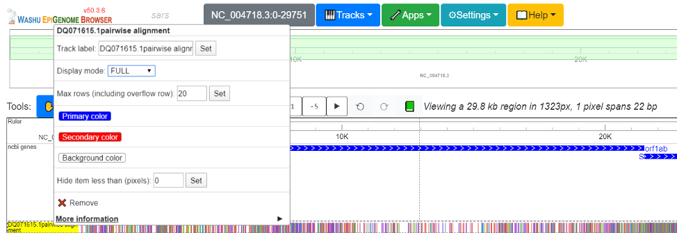
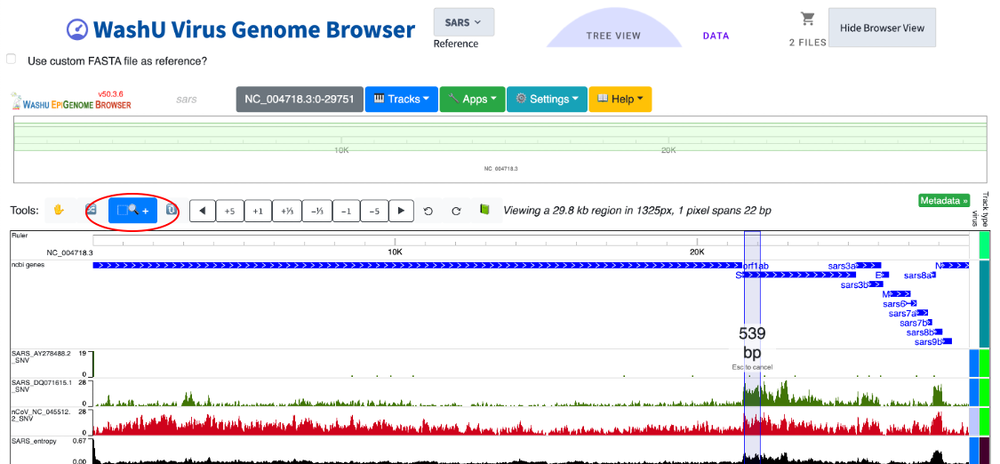
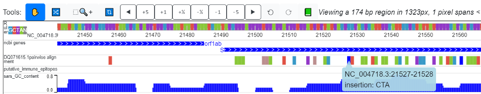
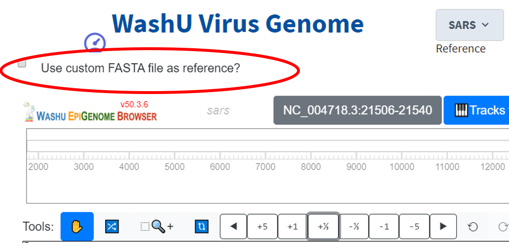
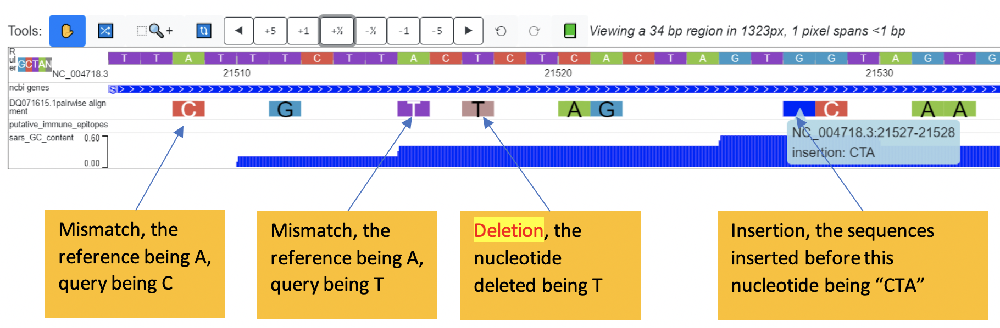
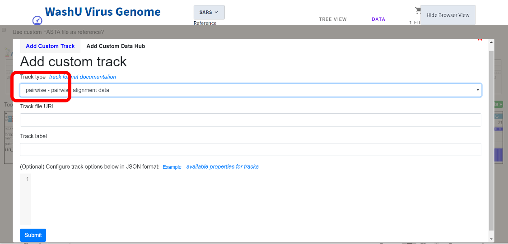
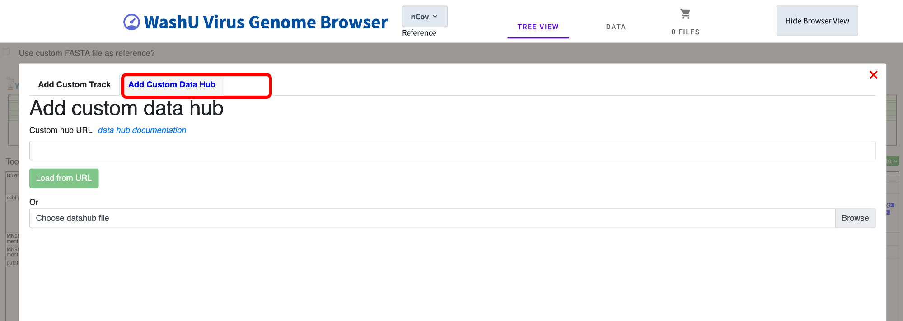

SNV track
=========

This section shows you how to display variations with the “SNV” track.

Understanding the SNV track
---------------------------

The SNV track is a new track type added to the Virus Genome Browser to view sequence variations. It supports 2 display modes: “density” mode for a “zoomed out” view and “full” mode for a “zoomed in” view. The “density” mode displays the density of variation, suitable for a genomic view, whereas the “full” mode has a color code for the detailed information of each variation, suitable for viewing an individual locus. To switch between density mode and full mode, right click on the head of the track and use the “display mode” drop down menu. 

Density mode and the “zoomed out” view
--------------------------------------

The density mode is created because when viewing the whole genome, individual variations are impossible to see. Instead, the density mode tells us where in the genome the variations are. This is illustrated in the screenshot below. 2 SARS strains (AY278488.2, aka the “BJ01”; “DQ71615.1, aka the “bat rp3”) and one nCoV strain (NC_045512.2, aka the reference nCoV) are aligned to the SARS reference genome. Sequence variation displayed in density mode shows that the divergence between the 2019-nCoV reference genome (red) and the SARS reference genome is higher than the divergence between the two additional SARS strains (green) and the SARS reference genome. 

For AY278488.2, the variation from reference is mainly confined to the beginning of the genome, while the remainder of the genome is relatively consistent with the reference. However, for DQ071615.1 (bat-derived), the 5’ end of gene S displays high variation from the reference genome. Likewise, the SARS Shannon track shows that the SARS genome is highly diverse across different strains at gene S. Once a region of interest is identified, the standard magnification tool (in red circle) of the browser can be used to quickly zoom into the region.

Full mode at a zoomed in view
-----------------------------

Zooming in to nucleotide level (and don’t forget to change display mode to “full” through right clicking) and you can see the color code!

Nomenclature:
^^^^^^^^^^^^^

**Reference**: the “reference” is the sequence you choose as reference, it’s the one completely color coded by nucleotides showing as “ruler” at the top. It has nothing to do with NCBI reference sequence (although the reference provided by us for the 4 viruses are indeed NCBI reference sequences). You can upload any sequence in FASTA format as the reference (check box at the upper left corner of the track view)

**Query**: The “query” is the sequence being aligned to the “reference”. 

**Variation** refers to events where the nucleotide of the query at a certain position is difference from the reference. It can be mismatch, insertion or deletion. 

Color code:
^^^^^^^^^^^

Mismatches:

1.	A mismatch from the reference happened at a certain nucleotide, the query being “A”: green (#89C738)
2.	the query being “T”: purple (#9238C7)
3.	the query being “C”: orange (#E05144)
4.	the query being “G”: light blue (#3899C7)
5.	the query being “N”: grey52 (#858585)

deletions:

1.	if a deletion happens to the query (a gap for the query in pairwise alignment), the nucleotide will be colored “Rosy brown (#BC8F8F)”

Insertions:

1.	the reference on the browser is always ungapped. If a insertion into the query happens (which means a gap for the reference in pairwise alignment), the nucleotide right after the insertion will be colored “blue”. Details of inserted sequences will be revealed in you click on the nucleotide colored blue.  

Behind a SNV track: the “pairwise” format
-----------------------------------------

Uploading interface
^^^^^^^^^^^^^^^^^^^

Suppose you figured out a perfect tool to do perfect alignment (or maybe you eyeballed everything) and you have results that are much better than the ones we have in the database, you can upload your alignment results to display as a SNV track, and here is how.

In the track view of the browser, click “Tracks” and then select “Custom Tracks”. This will lead you to a upload interface. Once there, select “pairwise” as your track type and enter the URL (just like any other tracks) 

The pairwise format
^^^^^^^^^^^^^^^^^^^

The pairwise format is an extension of the bed format with the 4th column showing variations from the reference. Specifically::

Column 1: name of the reference that the query is being aligned to
Column 2: the start position on the reference
Column 3: the end position on the reference
Column 4: variation type and detail.

For column 2 and 3: Since the pairwise format is per-nucleotide code, end = start+1. Also, the browser is 0 based, which means that if there is a mismatch at the first nucleotide, column 2 would be 0 while column 3 would be 1.

For column 4, the format is “variation_type: detail”. Variation types are: “insertion”, “deletion”, “mismatch”. For insertion, “detail” is the sequence inserted before this nucleotide. For “deletion”, the “detail” is the nucleotide of the reference at this position that was deleted. For “mismatch”, “detail” is the nucleotide of the query.

.. note:: Matches between the query and the reference are not coded in the pairwise format. 

.. code-block:: bash

    NC_004718.3     96      97      mismatch: T
    NC_004718.3     140     141     mismatch: C
    NC_004718.3     142     143     mismatch: C
    NC_004718.3     256     257     mismatch: G
    NC_004718.3     284     285     mismatch: A
    NC_004718.3     285     286     mismatch: A
    NC_004718.3     323     324     mismatch: T

    NC_004718.3     3089    3090    insertion: GG
    NC_004718.3     3093    3094    insertion: CTCA
    NC_004718.3     21527   21528   insertion: CTA
    NC_004718.3     21560   21561   insertion: C

    NC_004718.3     3059    3060    deletion: A
    NC_004718.3     3060    3061    deletion: G
    NC_004718.3     3061    3062    deletion: A
    NC_004718.3     3223    3224    deletion: A

.. note:: the files needs to sorted, zipped and indexed before uploading, just as any bed files. To zip the files:

.. code-block:: bash
    sort -k1,1 -k2,2n snvfile > snvfile.sort
    bgzip snvfile.sort
    tabix -p bed snvfile.sort.gz

To generate the pairwise format
^^^^^^^^^^^^^^^^^^^^^^^^^^^^^^^

We offer scripts to generate pairwise format from any pairwise alignment results (or eyeballing results) in markx3 (basically FASTA) format. The requirements are:

1.	the reference should be the first sequence
2.	only 2 sequences in the file (as it should be for pairwise alignment). 
3.	there shouldn’t be any positions where the reference and the query are both “gapped”. Our script tries to handle this but we are not sure it won’t cause any errors.

a sample::

    >test_reference ..
    ATGAGTCTCTCTGATAAGGACAAGGCTGCTGTGAAAGCCCTATGG------A
    >test_query ..
    CTG--TCTC-CTG---CCGACAAGACCAACGTCAAGGCCGCCTGGGGTAAGA

The script convert this to pairwise format is: “publicConvertMarkx3.py”, which calls “convert_tsv_to_bed_and_cat.sh”. 
To see help, use: 

.. code-block:: bash

    $ python publicConvertMarkx3.py
    usage: python publicConvertMarkx3.py <markx3> <out_pairwise> <script_dir>

    [Required]
            <markx3>					pairwise alignment output in markx3 format. the first sequence should be the reference
                                                
                                                
            <out_pairwise>			output pairwise formatted file that can be displayed directly on wash u virus browser as SNV track
            
            <script_dir>				the directory where all our scripts are stored
            
    contact: changxu.fan@gmail.com for help

The output files will be automatically zipped and ready to go!! 

Batch alignment from FASTA to pairwise format
^^^^^^^^^^^^^^^^^^^^^^^^^^^^^^^^^^^^^^^^^^^^^

We also offer another script that can perform pairwise alignment in batch (using EMBL aligners “stretcher” or “water”) and directly generate files in pairwise format that can be directly uploaded as SNV tracks.

The script is: publicAlignment.py

.. code-block:: bash

    $ python publicAlignment.py 
    Batch pairwise sequence alignment using "stretcher" or "water". 
    outputs "pairwise" format files that can be directly displayed on the wash u viral browser as SNV tracks.

    [Required (for job submission)]
            --script_dir			the directory where all our scripts are stored
            --ref_fa				fasta file containing reference sequence. All other sequences will be aligned to it. Should contain only one sequence
            --strain_fa				fasta file containing sequences of individual strains. Can contain multiple sequences. They will be aligned to ref_fa in a pair-wise manner separately
            --tempt_dir				tempt_dir to store intermediate files
            --SNV_dir				the directory to store generated pairwise files
            --aligner				aligner to use. currently support "stretcher" for global alignment and "water" for local alignment
            --email 				required by the embo aligners. you will not receive junk from them
    contact: changxu.fan@gmail.com for help

Batch upload as json files
^^^^^^^^^^^^^^^^^^^^^^^^^^

We offer another script that takes in a tab-delimited txt file (tsv file) listing the web location and track type of individual files and output a json file that can be used to upload multiple tracks in batch.

.. code-block:: bash

    $ python publicJsonGen.py 
    usage: python publicJsonGen.py <tsv> <json>

    [Required]
            <tsv>				a tsv file with 4 columns: name, url, track_type, virus. one line per track
                                                the file should contain header. 
                                                order of the columns doesn't matter.
                                                virus means virus type, used for metadata.
            <json>				output json file that can be directly uploaded onto wash u virus browser as custom datahub
            
    contact: changxu.fan@gmail.com for help

The tsv file that can be converted looks like this:

.. csv-table::
    :header: "name", "url",	"track_type", "virus"

    "SARS_AY278488.2_SNV", "https://your.url.to.file1", "pairwise",	"SARS"
    "SARS_DQ071615.1_SNV", "https://your.url.to.file2", "pairwise", "SARS"
    "SARS_AY278488.2_SNV", "https://your.url.to.file3", "pairwise", "SARS"

Upload json formatted datahub
^^^^^^^^^^^^^^^^^^^^^^^^^^^^^^^^

In the track view of the browser, click “Tracks” and then select “Custom Tracks”. This will lead you to a upload interface. Once there, click the “Add Custom Data Hub” tab, then just upload the json!

