Navigating the WashU Virus Genome Browser
=========================================

Virus Browser Home Page
-----------------------

The WashU Virus Genome Browser hosts tens to thousands of genomic sequences of 4 virus species: 2019-nCoV, severe acute respiratory syndrome coronavirus (SARS-CoV), Middle East respiratory syndrome coronavirus (MERS-CoV), and Ebola. When users first navigate to the browser home page (http://virusgateway.wustl.edu/), they are confronted with a drop-down menu of the 4 hosted viruses (red arrow), to select which virus they would like to view as their reference. 

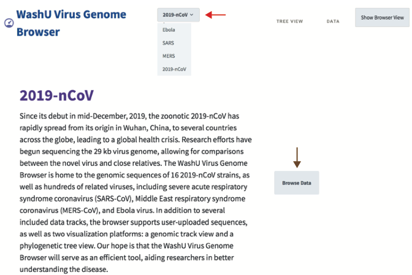

Upon selecting a reference species, and clicking “Browse Data” (brown arrow), the user is then taken to a table populated with sortable metadata for all available strains of the species. The user can then select strains of interest (examples are highlighted in purple), and continue to view those particular strains in either our genomic track browser view or see how their selected strains relate to all other available strains of the species in our phylogenetic tree view.

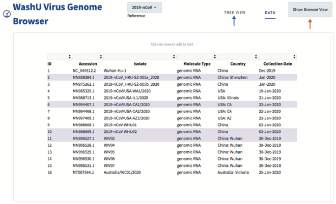

Genomic Track View
------------------

When users select the “Show Browser View” (orange arrow), they are taken to our standard browser view layout,  adapted from the WashU Epigenome Browser (https://epigenomegateway.wustl.edu/). The Virus Browser maintains the functionality of the Epigenome Browser while also incorporating new features particularly useful for probing virus genomes. Since many of these attributes are inherited from the Epigenome Browser, this document will focus on helping the user navigate functionality unique to the Virus Browser, and will provide reference to our WashU Epigenome Browser tutorial for shared functionality explanations. 

One of the additional features the Virus Browser offers is the ability for the user to upload a custom reference in the form of a FASTA file (circled in red below for reference). This feature is particularly useful for investigators who wish to study available virus strains in the context of their strain of interest. 

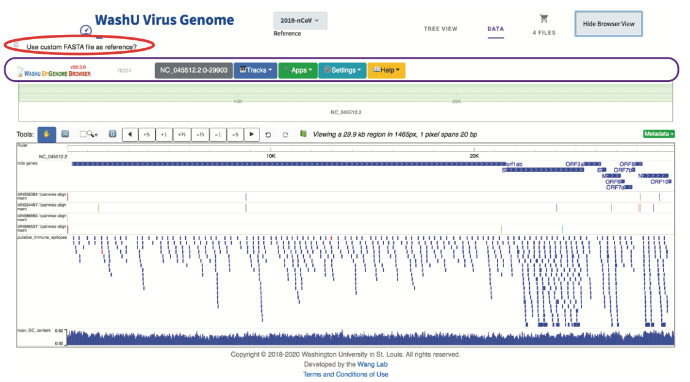

Beneath this option is a utility bar (circled in purple above) similar to the one provided in the Epigenome Browser. From left to right, this bar provides the WashU Epigenome Browser logo with version information, lists the reference species the user is currently viewing, provides a platform for navigating the genome to particular regions of interest, provides a drop-down menu for selecting data tracks to be viewed on the browser, provides several applications for viewing, sharing, or saving regions and tracks of interest, provides several customizable options in “Settings”, and lists many outlets for additional help navigating the browser. Detailed information regarding the use of the region locator can be found within the Epigenome Browser tutorial (https://eg.readthedocs.io/en/latest/usage.html#the-top-menu). 

Tracks
^^^^^^

The “Tracks” tab lists several functionalities, from loading existing tracks hosted by the browser to user-specified uploads. 

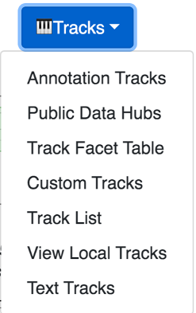

From this drop-down menu, if the user selects “Annotation Tracks”, an expandable menu of pre-existing data tracks appears for the user to select from. For the Virus browser, these tracks include gene annotations, genome comparison tracks, as well as predicted immune epitope locations, all of which can be loaded into the current browser session.

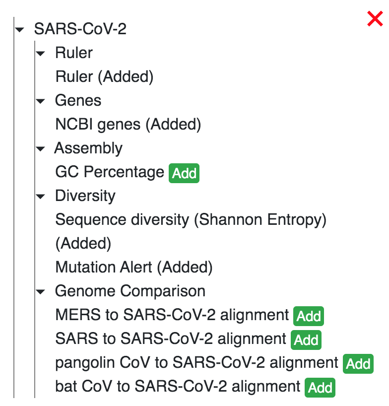

The “Custom Tracks” function, “View Local Tracks” function, and “Text Tracks” function all allow users to upload their own data tracks or datahubs to the browser. All data track types supported by the Epigenome Browser are also supported in the Virus Genome Browser. A comprehensive list and description of these tracks can be found here: https://eg.readthedocs.io/en/latest/tracks.html. In addition to these pre-existing track types, the Virus Browser also introduces the user to a new additional track type, called a “SNV” track, shown below.

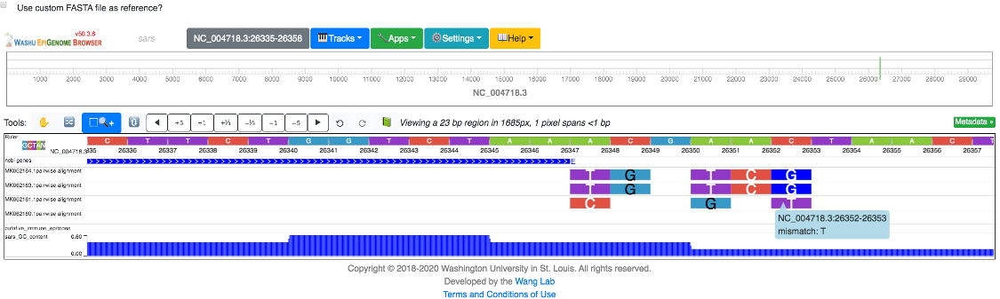

This track type displays any genomic variations the strain has from the listed reference. If the variant is a mismatch, the track will display the deviated nucleotide by default following the same color scheme as the reference (although, users can change this to their liking). If a user selects a particular mutation, a pop-up the variation is an insertion, the residue will be displayed dark blue, and the inserted positions will be displayed if possible (as shown on right in figure above). If the insertion is too long to display in the current view, the user can click on the position and a pop-up description will list the inserted residues. If a variation is a deletion in the strain relative to the reference, the position will be colored salmon, as shown below.

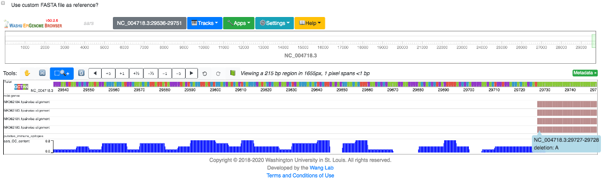

The “Track List” function provides the user with a summary of all tracks currently loaded in the browsing session, listing both the displayed track name as well as the track type.

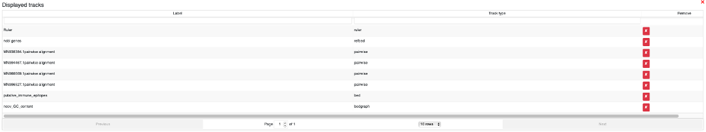

The functionality of “Public Data Hubs” and “Track Facet Table” are described in the Epigenome Browser tutorial (https://eg.readthedocs.io/en/latest/usage.html#).

Apps
^^^^

All applications available on the Virus Genome Browser are also available on the WashU Epigenome Browser, and are described in detail in the Epigenome Browser tutorial (https://eg.readthedocs.io/en/latest/usage.html#apps).

Settings
^^^^^^^^

Several browser settings have customizable options which the user may define. When selecting the “Settings” drop-down menu, several functions are provided, as shown below (and as described in the Epigenome Browser tutorial: (https://eg.readthedocs.io/en/latest/usage.html#settings):

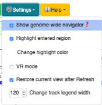

The first option “Show genome-wide navigator” is a toggle option, allowing the user to hide or show the complete genome layout at the top of the browser (circled in pink), highlighting in green the section of the genome currently being viewed in the browser.

.. image:: _static/use10.png

Help
^^^^

The “Help” drop-down menu provides several links to browser resources, including a documentation link, with helpful tutorials, examples, and suggestions for customizing your browsing experience, a link to the original or ‘old’ Epigenome Browser, a google groups page populated with questions and answers, a link to our Slack page, where users can directly communicate with the Virus Browser team in real time, a link to our Github page, which houses our repository of all available scripts, and a link to our YouTube channel, where walk-through clips can be viewed.

Tree View
---------

Linear Tree View
^^^^^^^^^^^^^^^^

Right-Aligned vs. Left-Aligned
~~~~~~~~~~~~~~~~~~~~~~~~~~~~~~

When the user selects “Tree View” (blue arrow in second figure), they are re-directed to a phylogenetic tree representation of all available strains for the given species selected. By default, a right-aligned, linear tree is displayed, as shown below (green and gray arrows, respectively):

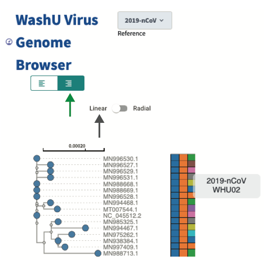

Accompanying the right-aligned tree display is a metadata heatmap, listing the virus species (first column), the sample molecular type (second column), and individual isolate (third column). The values of each square can be viewed by simply hovering above them (as shown above).

Right alignment was implemented to improve visualization of trees with many leaves with varying branch lengths. This view can be switched to a left-aligned linear tree view by selecting the left aligned tab:

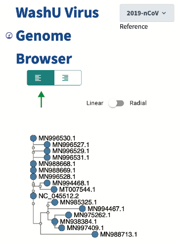

Radial Tree View
^^^^^^^^^^^^^^^^

In addition to linear tree views, all phylogenetic trees can alternatively be displayed in a radial tree format. This view can be very useful for visualizing long linear trees. Similar to the linear tree format, radial trees can be displayed either in right-aligned format:

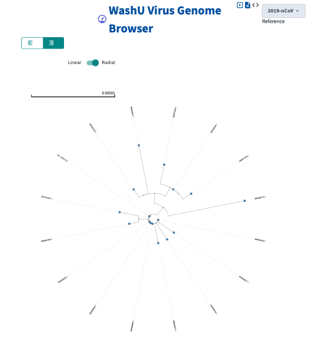

Or left-aligned format:

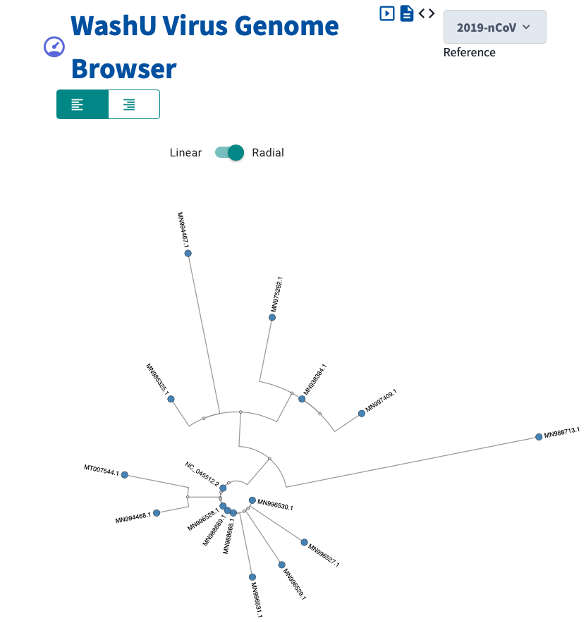

Leaf Highlighting Functions
---------------------------

In either the right- or left-aligned linear tree view, the user can select any leaf on the tree, and a pop-up menu of possible functions will appear as show below. Here, we will walk through each function, using the sample “MN994467.1” as an example.

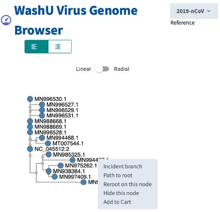

Selecting “Incident branch” will highlight the selected branch:

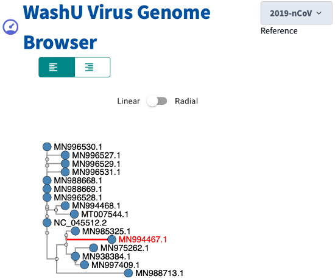

Selecting “Path to root” will illuminate the path from the selected branch to the root of the tree:

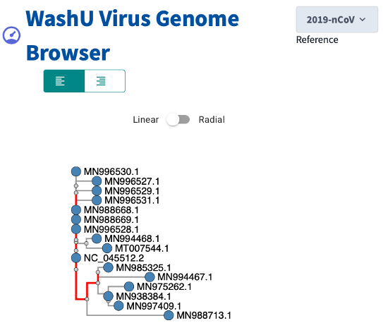

Selecting “Reroot on this node” reconfigures the tree to display all evolutionary relationships of each strain with respect to selected strain:

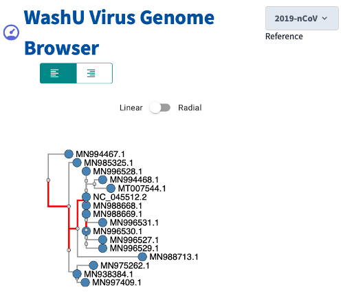

Selecting “Hide this node” hides the selected node, and displays a black circle at the closest branchpoint:

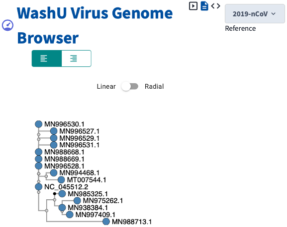

Selecting “Add to cart” adds the selected strain to the user’s cart for easy viewing.

Branch Highlighting Functions
^^^^^^^^^^^^^^^^^^^^^^^^^^^^^

In either the linear or radial, right- or left-aligned trees, the user is provided with several additional functions for viewing branches of the tree. When a user selects a small, gray node within the tree, a pop-up menu with several functions appears. We will be demonstrating these functionalities by selecting each time the node circled in red below:

.. image:: _static/use20.png

Selecting “Collapse Subtree” minimizes the all branches extending from the node. Likewise, the subtree can be re-populated by selecting the node again and clicking on “Expand Subtree”:

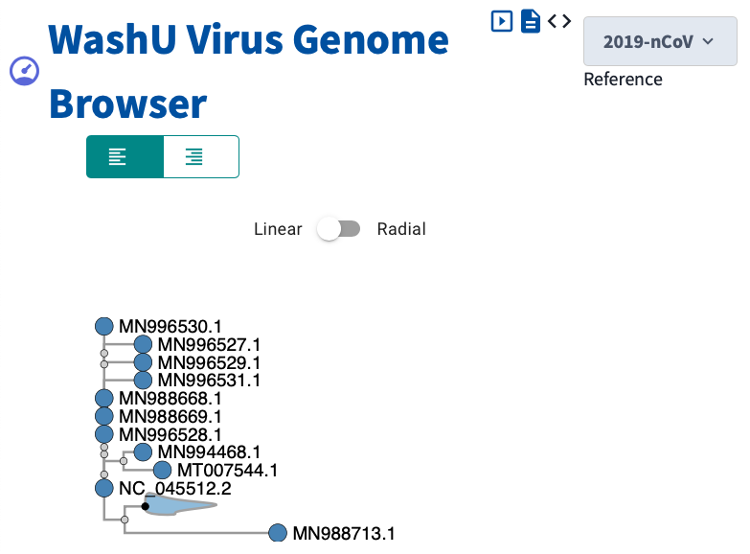

Selecting “All Descendent Branches” highlights in red all branches extending from the node:

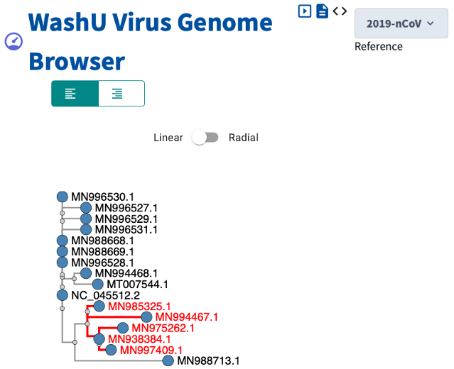

Selecting “All Terminal Branches” highlights in red all branches stemming from the node that are directly connected to leaves:

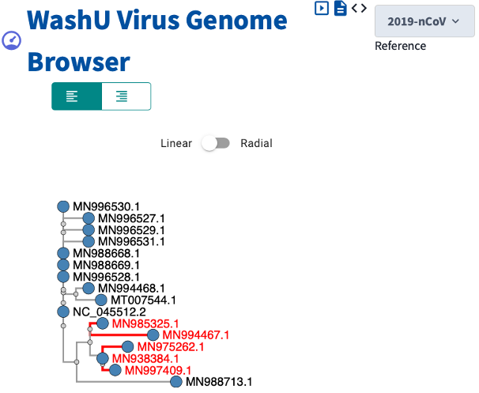

Whereas selecting “All internal branches” highlights in red all branches stemming from the node that are not directly connected to leaves:

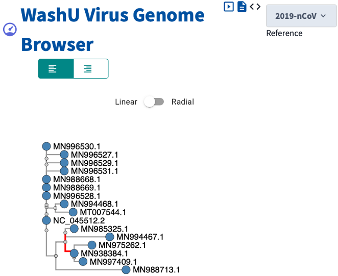
